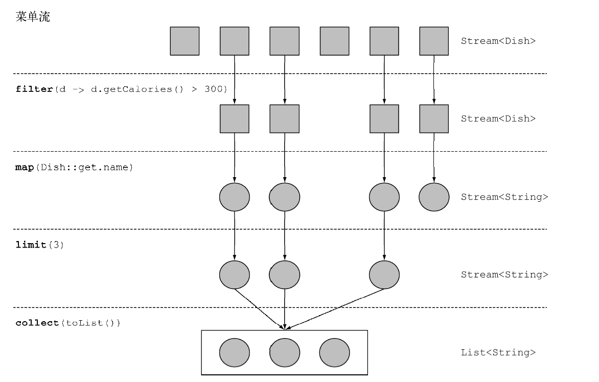
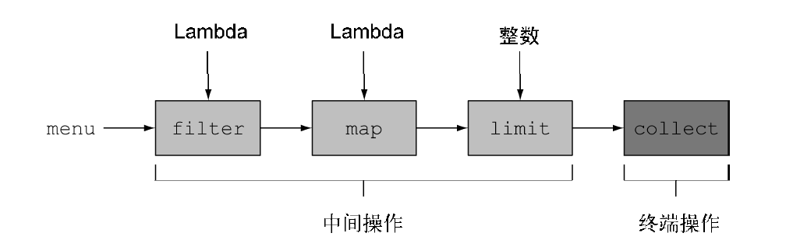

# 第四章 引入流

## 什么是流

流允许你以声明性方式处理数据集合（通过查询语句来表达，而不是临时编写一个实现）。流还可以透明地并行处理。

```java
@Data
@AllArgsConstructor
public class Dish {
    private String name;
    private boolean vegetarian;
    private int calories;
    private Type type;

    public enum Type {
        MEAT, FISH, OTHER
    }
}
```

我们需要对菜肴做如下处理：返回低热量的卡路里菜肴名称，并按照卡路里排序 。

```java
List<Dish> menu = Arrays.asList(
                new Dish("pork", false, 800, Dish.Type.MEAT),
                new Dish("beef", false, 700, Dish.Type.MEAT),
                new Dish("chicken", false, 400, Dish.Type.MEAT),
                new Dish("french fries", true, 530, Dish.Type.OTHER),
                new Dish("rice", true, 350, Dish.Type.OTHER),
                new Dish("season fruit", true, 120, Dish.Type.OTHER),
                new Dish("pizza", true, 550, Dish.Type.OTHER),
                new Dish("prawns", false, 300, Dish.Type.FISH),
                new Dish("salmon", false, 450, Dish.Type.FISH)
        );
```

```java
List<String> lowCalories = menu.stream()
                .filter(item -> item.getCalories() <= 400)
                .sorted(Comparator.comparing(Dish::getCalories))
                .map(Dish::getName)
                .collect(Collectors.toList());
```

为了利用多核架构运行这段代码，你只需要将`stream`改为`parallelStream` 。

另外一个需求是 ： 对菜肴类别进行分组处理 ：

```java
Map<Dish.Type, List<Dish>> dishByType = menu.stream().collect(Collectors.groupingBy(Dish::getType));
```

Java8中的API可以让你写出这样的代码 ： 

- 声明性 ： 更简洁、易懂
- 可复合 ： 更灵活
- 可并行 ： 性能更好

## 流简介

🔺『流』的定义 —— 从『支持**数据处理操作**的**源』生成**的『**元素序列**』 。

- 元素序列 ：就像集合一样，流也提供了一个接口，可以访问特定元素类型的一组有序值。因为集合是数据结构，所以集合的主要目的是以特定的时间或空间复杂度存储和访问元素（如`ArrayList`与`LinkedList`）。但**流的目的在于表达计算**，比如你前面见到的`filter`、`sorted`和`map` 。集合讲的是数据，流讲的是计算。
- 源 ：流会使用一个提供数据的源，如集合、数组或者输入/输出资源。请注意，从有序集合生成流时会保留原有的顺序。由列表生成的流，其元素顺序与列表一致。
- 数据处理操作 ：流的数据处理功能支持类似于数据库的操作，以及函数式编程语言中的常用操作，如`filter`、`map`、`reduce`、`find`、`match`、`sort`等。**流操作可以顺序执行，也可以并行执行**。

下面这段代码列举了卡路里高（大于三百）的食物名称，并只展示前三个（不排序）：

```java
List<String> threeHighCaloriesDishNames = menu.parallelStream()
    									.filter(item->item.getCalories > 300)
    									.map(Dish::getName)
    									.limit(3)
    									.collect(Collectors.toList());
```

在上面代码中，我们对`menu`调用`stream`方法，由菜单得到一个流。<u>数据源</u>就是菜肴列表，它给流提供了一个<u>元素序列</u>。接下来，对流应用一系列数据处理操作：`filter`、`map`、`limit`、`collect`。除了`collect`之外，所有的数据处理操作都会返回另外一个流，这样它们就可以接成一条流水线，于是就可以看作对源的一个查询。最后，`collect`操作开始处理流水线，并返回结果。在调用`collect`之前，没有任何结果产生，实际上根本就没有从`menu`里选择元素。你可以这么理解 ： **链中的方法调用都在排队等待，直到调用`collect`**



- [ ] `filter` —— 接受Lambda，从流中排除某些元素
- [ ] `map` —— 接受一个Lambda，将元素转换成其他形式或提取信息
- [ ] `limit` —— 截取流，使其元素不超过给定数量
- [ ] `collect` —— 将流转换为其他形式

## 🎯 流与集合

流就像是一个延迟创建的集合 ： 只有在消费者要求的时候才会计算值。

### 只能遍历一次

和迭代器类似，流只能遍历一次。遍历完之后，我们就说这个流已经被消费掉了。

```java
List<String> title = Arrays.asList("Java8", "in", "action");
Stream<String> stream = title.stream();
stream.forEach(System.out::println);
// ! stream.forEach(System.out::println);
```

### 外部迭代和内部迭代

外部迭代 ：

```java
List<String> names = new ArrayList<>();
for(Dish d:menus){
    names.add(d.getName());
}
```

```java
List<String> names = new ArrayList<>();
Iterator<String> iterator = menus.iterator();
while(iterator.hasNext()){
    Dish d = iterator.next();
    names.add(d.getName());
}
```

内部迭代 ： 

```java
List<String> names = menu.stream()
    				.map(Dish::getName)
    				.collect(Collectors.toList());
```

## 🏭 流操作

`java.util.stream.Stream`中的`Stream`接口定义了很多操作。他们可以分为两大类。

```java
List<String> threeHighCaloriesDishNames = menu.stream() // 从菜单中获取流
    	// 中间操作
        .filter(item -> item.getCalories() > 300)
        .map(Dish::getName)
        .limit(3)
    	// 将Stream转换为List
        .collect(Collectors.toList());
```

- `filter`、`map`、`limit`可以连成一条流水线
- `collect`触发流水线执行并关闭它

可以连接起来的流操作被称之为**中间操作**，关闭流的操作称之为**终端操作**



### 中间操作

诸如`filter`或`sorted`等中间操作会返回另一个流，这让多个操作可以连接起来形成一个查询。重要的是，除非流水线上触发一个终端操作，否则中间操作不会执行任何处理。中间操作一般都可以合并起来，在终端操作时一次全部处理。

```java
List<String> threeHighCaloriesDishNames = menu.stream()
        .filter(item -> {
            System.out.println("filter : " + item.getName());
            return item.getCalories() > 300;
        })
        .map(item -> {
            System.out.println("map : " + item.getName());
            return item.getName();
        })
        .limit(3)
        .collect(Collectors.toList());
```

代码将打印 ： 

```
filter : pork
map : pork
filter : beef
map : beef
filter : chicken
map : chicken
[pork, beef, chicken]
```

尽管`filter`和`map`是两个独立的操作，但是它们合并到同一次遍历中了（我们把这种技术称之为<u>**循环合并**</u>）

### 终端操作

终端操作会从流的流水线生成结果。其结果是『任何不是流』的值。例如`List`、`Integer`甚至是`void`。例如，`forEach`是一个返回`void`的终端操作。

```java
menu.stream().forEach(System.out::println);
```

### 使用流

总而言之，流的使用一般包括三件事 ： 

- 一个数据源（如集合）来执行一个查询
- 一个**中间操作链**，形成一条流的流水线
- 一个**终端操作**，执行流水链，并能生成结果

|    操作    | 类型 |  返回类型   |    操作参数     |  函数描述符  |
| :--------: | :--: | :---------: | :-------------: | :----------: |
|  `filter`  | 中间 | `Stream<T>` | `Predicate<T>`  | `T->boolean` |
|   `map`    | 中间 | `Stream<R>` | `Function<T,R>` |    `T->R`    |
|  `limit`   | 中间 | `Stream<T>` |      `int`      |              |
|  `sorted`  | 中间 | `Stream<T>` | `Comparator<T>` | `(T,T)->int` |
| `distinct` | 中间 | `Stream<T>` |                 |              |


|   操作    | 类型 |                            目的                            |
| :-------: | :--: | :--------------------------------------------------------: |
| `forEach` | 终端 | 消费流中的每个元素并对其应用`Lambda`。这一次操作返回`void` |
|  `count`  | 终端 |           返回流中的元素个数。这一操作返回`long`           |
| `collect` | 终端 |    把流规约成一个集合，例如`List`、`Map`甚至是`Integer`    |

## 小结

- 什么是流？流是“从支持数据处理操作的源生成的一系列元素”
- 什么是流水线？多个操作流本身会返回一个流，这样多个操作就可以链接起来，形成一个大的流水线。
- 流中的元素只会按需生成，流只能被遍历一次。流利用内部迭代 ： 迭代通过`filter`、`map`、`sorted`等操作被抽象掉了
- 流操作由两类 ： 中间操作和终端操作
- `filter`、`map`等中间操作会返回一个流，并可以链接在一起。可以用它们来设置一条流水线，但不会生成任何结果
- `forEach`和`count`等终端操作会返回一个非流的值，并返回流水线以返回结果 


