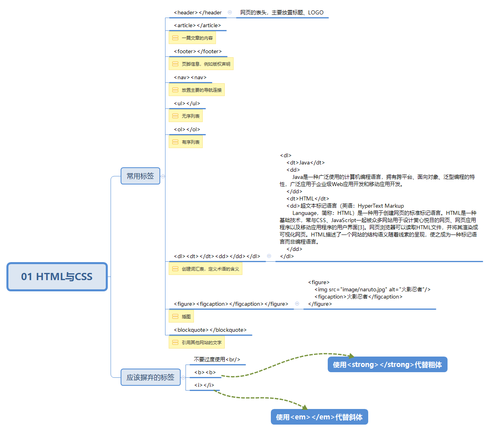

# 01 HTML与CSS

## HTML5新增标签

- `<nav></nav>`：放置主要的导航连接
- `<code></code>`：代码块
- `<header></header>`：网页的标头，通常放置网页标题
- `<footer></footer>`：页脚信息，例如版权声明、法律信息
- `<aside></aside>`：网页的侧栏、附加内容
- `<article></article>`：一篇文章的内容
- ``<figure><figcaption></figcaption></figure>`：标识插图

```html
<nav>
	<ul>
		<li><a href="#">主要链接1</a></li>
		<li><a href="#">链接b</a></li>
	</ul>
</nav>
```

```html
<figure>
    
    <figcaption>火影忍者</figcaption>
</figure>
```

## 应该摒弃的HTML标签

- <del>别用`<b>`和 `<i>`标签强调文字</del>，应该使用`<strong>`标签来表示粗体，使用`<em>`表示斜体
- 不要使用`<table>`标签布局网页
- 不要滥用`<br>`标签

## HTML验证网站

```http
https://validator.w3.org/
```

## 指点迷津

- 无序列表：`<ul></ul>`
- 有序列表：`<ol></ol>`
- 创建词汇表，定义术语含义：`<dl>`、`<dt>`、`<dd>`
- 引用其他网站文字：`<blockquote></blockquote>`

```html
<dl>
    <dt>Java</dt>
    <dd>
        Java是一种广泛使用的计算机编程语言，拥有跨平台、面向对象、泛型编程的特性，广泛应用于企业级Web应用开发和移动应用开发。
    </dd>
    <dt>HTML</dt>
    <dd>超文本标记语言（英语：HyperText Markup
        Language，简称：HTML）是一种用于创建网页的标准标记语言。HTML是一种基础技术，常与CSS、JavaScript一起被众多网站用于设计赏心悦目的网页、网页应用程序以及移动应用程序的用户界面[3]。网页浏览器可以读取HTML文件，并将其渲染成可视化网页。HTML描述了一个网站的结构语义随着线索的呈现，使之成为一种标记语言而非编程语言。
    </dd>
</dl>
```

## 总结

